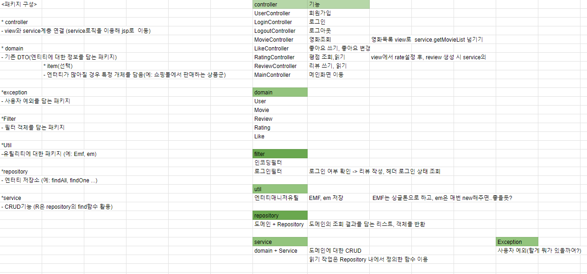
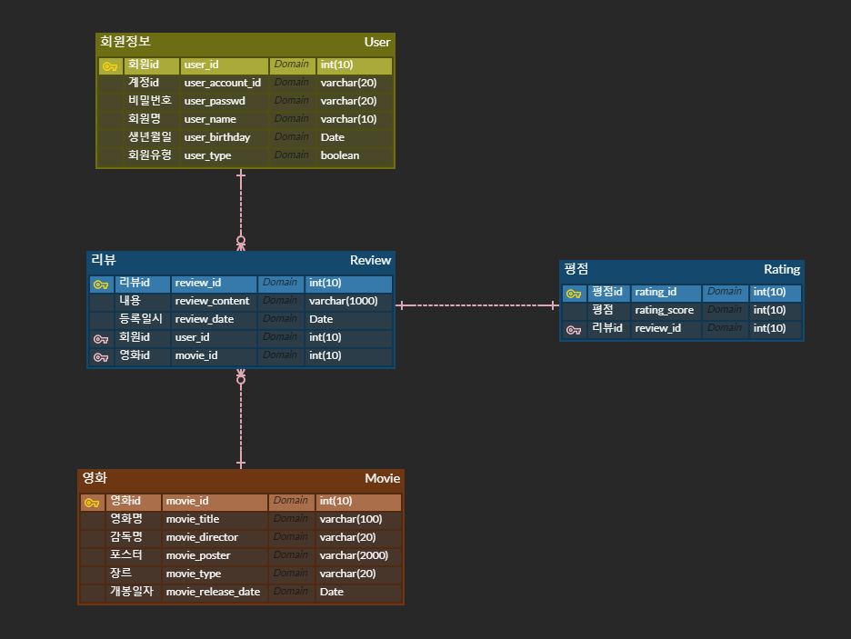

# Review Movie

It is a project to create a site using JSP where you can search for movies and see other people's ratings and reviews or write your own ratings and reviews.

## ER Diagram of the project

## 프로젝트 구조
View ↔ (Filter) ↔ Controller ↔ Service ↔ Repository ↔ Domain(Entity)
Filter는 다수의 Container 에서 공통적으로 필요로 하는 전처리 로직을 수행한다.
Controller 는 View에서 보여줄 내용을 가져오기 위해 Service 에 요청을 하고 결과를 View로 돌려주는 역할을 한다.
View에서 Repository까지는 DTO 객체를 통해 데이터를 주고 받고 Repository에서만 Entity에 직접 접근한다.
Service 및 Repository는 자원을 절약하기 위해 싱글톤으로 되어 필요한 곳에서 이미 만들어진 인스턴스를 호출해 쓰는 방식으로 사용한다.

## 화면 구조

